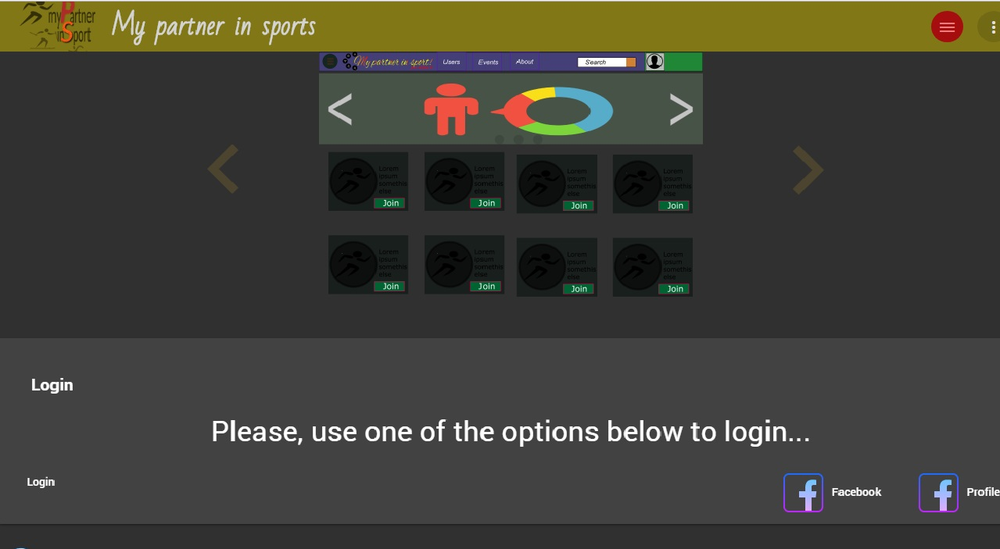
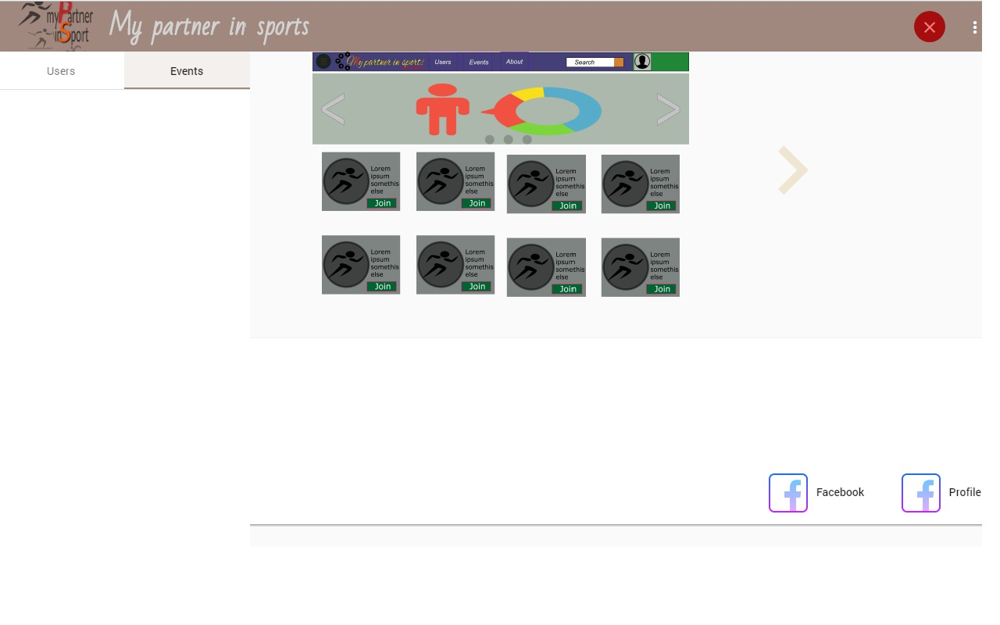

## MPIS-Dummy

Demonstrator project of fully-typed stack (`Angular 5`, `Angular Material 5`, `Flex-Layout`, `facebook login`, `material design`, `typeorm`, `typedi`, `nest.js`, `mongodb`)

---

 
----

All designs, graphical assets, and ideas **reserved** and could only be reused by directly granted permissions  from Vladimir Ovsyukov <<me@ovsyukov.info>>

-----

Redistribution

MIT Copyright (c) Vladimir Ovsyukov <ovsyukov@yandex.com> -- with link required to original sources point